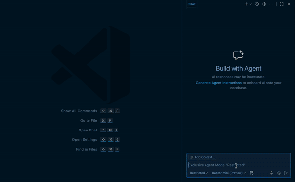
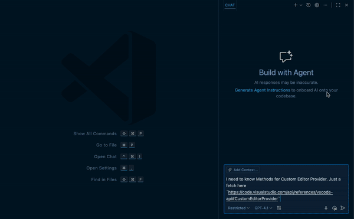
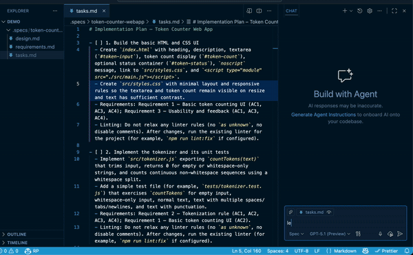
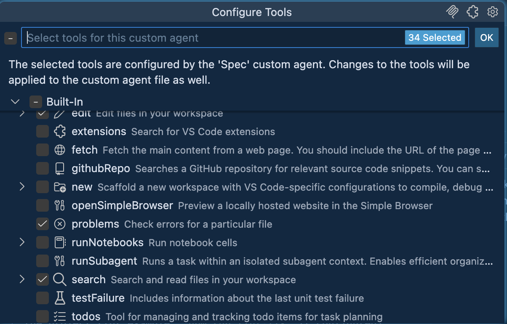

# Relief Pilot

Your GitHub Copilot's new best buddy. Relief Pilot brings the features you've been waiting for right into VSCode, giving you advanced control to make your AI assistant better than ever.

## Key Features

### Ask Report "Human In The Loop"

- Interactive webview to prompt the user with Markdown content and predefined options or custom input. Includes copy-to-clipboard, external links handling, submit/cancel actions, a configurable countdown timer with pause/resume, and a history of previous reports.


Example of "Human In The Loop" mode in chat of Github Copilot:

```text
Can you check the docs and explain how the project works? #ask_report
```

### Terminal Operations

- Execute commands within VSCode's integrated terminal (supports background/foreground execution, on-the-fly command editing, and cancellation with feedback!).
- You can tell the agent to stop asking you for permission! Just explicitly specify `"destructiveFlag": false` in your requests.



### AI Fetch URL

- The AI agent can fetch documentation in Markdown format, extracting content strictly by topic to save your context window — an alternative to RAG using Language Model APIs. Keep in mind that "thinking" models take longer per request (Time vs. Your Agent's Context Window Size), so we use any model without hallucinations and at zero cost per request.



### "Spec" mode

- A prepared prompt is installed into the agent with just a couple of clicks — any feature will be formally documented EARS-style at the cost of one premium request! No more surprises! Plan and execute tasks for features of any size.


- It's recommended to work on each task in a new chat



## Your Favorite Toolkit Already on Board

- Terminal:
  - **execute_command**: Execute commands in VSCode’s integrated terminal
  - **get_terminal_output**: Fetch output from a specified terminal
- IDE Integration:
  - **code_checker**: Retrieve current diagnostics for your code
  - **focus_editor**: Focus specific locations within files
- The Crown Jewel of the Extension:
  - **ask_report**: Prompt the user via a webview using Markdown and optional predefined options.
  - **ai_fetch_url**: Fetching and extracting web content data using a sub-agent
- Search Engines:
  - **duckduckgo-search**: Search the web using DuckDuckGo with HTML scraping
  - **google_search**: Search Google and return relevant results using the Programmable Search Engine
  - **felo_search**: AI-powered search with contextual responses for up-to-date technical information (releases, advisories, migrations, benchmarks, community insights)
- Searching and Extracting Documentation in Context7
  - **context7_resolve-library-id**
  - **context7_get-library-docs**
- Searching and Reading Data via GitHub API:
  - **github_search_repositories**
  - **github_get_file_contents**
  - **github_list_pull_requests**
  - **github_pull_request_read**
  - **github_search_code**
  - **github_list_releases**
  - **github_get_latest_release**
  - **github_search_issues**
  - **github_list_issues**
  - **github_issue_read**

## Quick Start

1. Install from the Visual Studio Marketplace
   [Visual Studio Marketplace — reliefpilot](https://marketplace.visualstudio.com/items?itemName=ivan-mezentsev.reliefpilot)
2. Disable the IDE's default terminal tools (and any other unnecessary ones in your project)
   
3. Recommended rules for AI agents:

   ```markdown
   ## Language & Communication
   - **Web search**: DuckDuckGo/Google queries in English principally

   ## Code Development
   - **After code editing**: Always check code using `code_checker` tool

   ## Tools Priority
   1. **First priority**: MCP Context7 for searching documentation/API/guides (`context7_resolve-library-id` + `context7_get-library-docs`)
   2. **Second priority**: Web search
   3. **Third priority**: `browser_navigate` if the request is blocked or local debugging of web resources is required
   4. **Rule**: Always try Context7 first for technical/programming queries
   5. **Rule**: Always use ONLY `execute_command`, `get_terminal_output` instead of any other command line tool to perform tasks

   ## Terminal Analysis
   - **CRITICAL**: MUST always read and analyze complete terminal output, not just exit code
   - **Forbidden**: Never make assumptions based solely on exit codes
   - **Required**: Always examine actual output text, error messages, warnings, and any other information displayed before providing response or next steps

   ## Decision Making
   - **Ambiguous tasks**: ALWAYS clarify using `ask_report` tool
   - **Requires decisions**: ALWAYS clarify using `ask_report` tool
   - **HARDMUST Rule**: If the user says to read/study/check/consult documentation (any language, case-insensitive), the assistant MUST: (1) stop assumptions; (2) fetch & examine authoritative docs via required tool order (Context7 → web search → others); (3) show a brief evidence summary (sources/paths/URLs) BEFORE acting. If docs are missing or ambiguous → status BLOCKED + one clarifying question. Any action or advice without cited doc basis = BLOCKER. BLOCKER

   ## Code Development
   - **After code editing**: Always check code using `code_checker` tool
   - **Final confirmation**: MUST ask user if all requirements from specification are completed using `ask_report` tool with work report

   ## Final gate:
   - For the final answer (after actions/edits/checks), it is **MANDATORY** for the agent to call `ask_report`. That single `ask_report` call must contain the complete final answer/report (i.e., the full response presented to the user inside the `ask_report` interface) and must simultaneously present the satisfaction option ["Yes, everything is OK"]. The agent must deliver the full report within that single `ask_report` call and collect the user's selection from it.
   - If the user selects an option other than "Yes, everything is OK", continue working until the comments are resolved and repeat the post-answer `ask_report` call with an updated complete report.
   - There are no exceptions (including minor edits, any answers).

   ## Proposal policy (no unsolicited changes)
   - If you see a potential improvement, do NOT apply it autonomously.
   - Propose it via `ask_report` with concise options; proceed only after confirmation.

   ## Ambiguity & blocking policy
   - If the source, scope, or exact phrasing is unclear or unavailable — do NOT change files.
   - Return a short BLOCKED report:
     - `status: BLOCKED`, `reason: <why>`, `needs: <what is required>`, `next: <proposed minimal next step>`.
   - Ask 1 precise clarifying question when essential to proceed.

   ## Scope control & change preview
   - Modify only the explicitly specified area/files/keys. Do not touch anything else.
   - For batch text edits (multiple keys/sections), show a preview mapping `key → old → new` and request confirmation, unless the user explicitly said "no preview/confirm".

   ## Post-change checks & reporting
   - After edits: run code checks (`code_checker`).
   - Report briefly: PASS/FAIL, list of changed keys/files, and a one-line requirements coverage (Done/Deferred + reason).
   ```

4. Stock up on tokens — you'll need them for maximum comfort:

- [context7.com/dashboard](https://context7.com/dashboard)
- [Google API](https://support.google.com/googleapi/answer/6158862?hl=en)
- [Google Search Engine ID](https://support.google.com/programmable-search/answer/12499034?hl=en)
- [Create a GitHub Personal Access Token](https://github.com/settings/personal-access-tokens/new)

## Why Not MCP?

- There are already projects implementing most of this functionality:
  - [VSC-MCP Server](https://github.com/ivan-mezentsev/vsc-mcp?tab=readme-ov-file#vsc-mcp-server)
  - [MCP Interactive](https://github.com/ivan-mezentsev/mcp-interactive?tab=readme-ov-file#mcp-interactive)
  - [MCP-GetWeb](https://github.com/ivan-mezentsev/mcp-getweb?tab=readme-ov-file#mcp-getweb)
- The main reason: in VSCode, MCP tools are launched only after sending the first prompt, making it practically impossible to select the necessary set of tools in a new project **before** starting work with Copilot. You also love that "tool optimization" at the beginning of every request with random results, right? :)
- The second reason: a rich set of features right inside the IDE with tight integration into Copilot's chat, and where would we be without Language Model APIs?

## Local Build & Installation

### Build the Extension

```bash
cd packages/extension
npx vsce package --no-dependencies --allow-missing-repository
```

Install the packaged extension from disk:

```bash
code --install-extension packages/extension/reliefpilot-0.1.0.vsix
```

## License and Notices

This extension is licensed under the MIT License (see LICENSE).

It bundles or incorporates third‑party software under their respective permissive licenses (Apache‑2.0, BSD‑3‑Clause, MIT). Full attributions and license texts are provided in the NOTICE file included with the VSIX.
